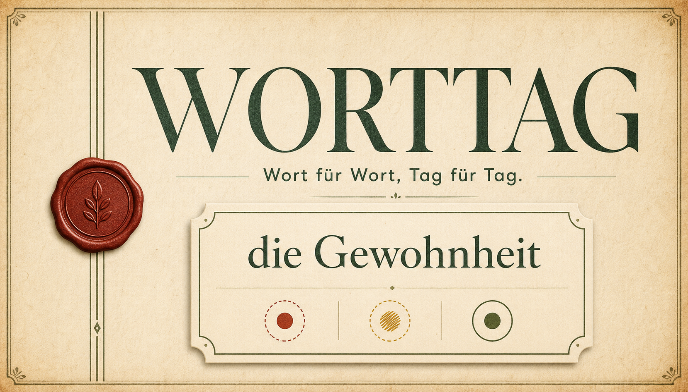

# Worttag

> Wort für Wort, Tag für Tag.
> 一款以掌握循环、间隔复习和每日短文为核心的德语词汇学习应用。

[](LICENSE)
[](public/wordbooks/ATTRIBUTION.txt)
[](https://worttag-deutsch-lernen.mitsuhaalpha.chatgpt.site/)

[在线体验 Worttag](https://worttag-deutsch-lernen.mitsuhaalpha.chatgpt.site/)



## 项目简介

Worttag 希望把“认识一次”变成“真正记住”。每个单词需要积累三个光点才能完成本轮学习，并在后续按照间隔复习计划再次出现。应用提供 A1–C1 五级词书、德语语法与例句、拼写测试、每日短文，以及可选的跨设备云存档。

界面以羊皮纸、墨绿和火漆红为主视觉，同时提供多套皮肤与深浅色模式。名词冠词使用独立颜色：`der` 蓝色、`die` 红色、`das` 绿色。

## 核心功能

- **三光点掌握循环**：已知 `+1`，模糊 `-1`，未知清空；集满三个光点才完成。
- **递进式学习**：首次见词为选择题，第二次提供无中文词义的例句，第三次只保留单词本身。
- **自适应重现**：根据当前光点数将单词插回队列后方，降低连续重复造成的虚假熟悉感。
- **选择题自动判断**：选对按已知记录；选错按未知记录，并展示正确词义后继续。
- **拼写测试**：每轮结束后可选择进行听音拼写，不改变已经获得的光点。
- **A1–C1 词书**：共 10,000 个 CEFR 课程词条，支持顺序或乱序学习。
- **词库分类浏览**：在词库中按“全部词书”、A1–C1 或独立的“专项词书”筛选，并查看各类词数与已熟记数量。
- **词库整理**：支持按原词书顺序、德语字母或词性排序；卡片可展开查看词形、用法、语法和源例句。
- **中德双语检索**：可按德语原形、变位、复数、中文释义、中德例句与语法说明查词。
- **词典核验弹窗**：点击学习页或词库中的单词，可查看 Worttag 中文义项、德语 Wiktionary 开放释义、DWDS 收录证据，并直达 Duden、PONS 与 Langenscheidt 原词条。
- **间隔复习**：根据未知、模糊、已知三档判断自动安排下次出现时间。
- **每日短文**：完成当天计划后，使用当日学习词汇生成分级德语短文。
- **云存档**：登录同一 ChatGPT 账户后，可在电脑、平板与手机之间自由同步进度。
- **键盘操作**：`F` 播放发音、空格揭晓、`Q/W/E` 进行记忆判断。
- **个性化设置**：深色、浅色、跟随系统；队列词数、每日队列数、词书等级、学习顺序、自动朗读等。

## 学习流程

| 阶段 | 呈现方式 | 完成规则 |
| --- | --- | --- |
| 第一次遇见 | 单词与词义选择题 | 选对获得一个光点，选错清零 |
| 第二次遇见 | 单词与德语例句，不显示中文词义 | 根据回忆选择未知、模糊或已知 |
| 第三次及以后 | 仅显示单词 | 集满三个光点后完成 |
| 队列结束 | 可选听音拼写 | 不改变已经获得的光点 |
| 后续复习 | 按到期时间重新进入队列 | 判断结果更新复习间隔 |

## 词书说明

Worttag 将词汇按常见交际场景、频率和课程进度划分为 A1、A2、B1、B2、C1。CEFR 描述的是语言能力等级，并不存在唯一的官方固定词表，因此这里的等级属于 Worttag 的课程分类，并非 Goethe 官方词表。

| 等级 | 词条数 | 学习侧重 |
| --- | ---: | --- |
| A1 | 750 | 自我介绍、家庭与日常动作 |
| A2 | 1,000 | 住房、工作、旅行与简单经历 |
| B1 | 1,200 | 叙述经历、处理问题与表达看法 |
| B2 | 3,000 | 复杂讨论、因果关系与抽象主题 |
| C1 | 4,050 | 精确表达、学术与专业语境 |

当前主词库按最新的 `germany-words.html` 重新导入，A1-C1 五个 CEFR 分组共 10,000 条词条，另有 151 条独立“专项”词条，作为词库中的单独模块浏览，不进入主学习和复习队列。源文件中的每条例句会与对应释义绑定并在词典详情中展示；没有例句的条目保持空白，不生成补充例句。动词会直接复用源表里的完整变位数据，在“分词、直陈式、一虚、二虚、命令式”五个分组中展示各时态和人称，不再只保留简表。可复现导入脚本为 `scripts/import_combined_wordbook.py`，完整变位同步脚本为 `scripts/import_full_conjugations.mjs`；版本清单见 [`public/wordbooks/manifest-v2.json`](public/wordbooks/manifest-v2.json)。旧的 Core 6000 数据仍保留为 v1 历史资源，便于回溯与兼容。

CEFR 是能力描述框架，不规定一份唯一且固定的德语词表。Worttag 的等级归类参考欧洲委员会的 [CEFR 分语言参考级别描述](https://www.coe.int/en/web/common-european-framework-reference-languages/reference-level-descriptions)，并使用 Goethe-Institut 的 [A2](https://www.goethe.de/de/m/spr/prf/ueb/pa2.html) 与 [B1](https://www.goethe.de/de/m/spr/prf/ueb/pb1.html) 考试词汇材料核对级别边界；词条和例句均按本项目的课程目标独立编排，并非复制官方词表。

## 本地运行

### 环境要求

- Node.js `>= 22.13.0`
- npm

### 安装

```bash
git clone https://github.com/mitsuhaalpha-web/worttag.git
cd worttag
npm install
npm run dev
```

打开终端显示的本地地址即可。没有登录和云数据库时，学习、复习、词书、每日短文与本地进度仍可正常使用。

### 常用命令

| 命令 | 用途 |
| --- | --- |
| `npm run dev` | 启动本地开发环境 |
| `npm run build` | 构建生产版本 |
| `npm test` | 构建并运行自动测试 |
| `npm run lint` | 检查代码规范 |
| `npm run db:generate` | 根据 Drizzle Schema 生成数据库迁移 |

## 云存档与部署

云存档使用 D1 兼容数据库保存用户学习快照，并通过部署平台注入的 ChatGPT 身份请求头识别用户。数据库只存储经过哈希处理的账户标识和学习快照，不存储原始账户邮箱；界面可显示部署平台提供的当前账户名称。

如需在自己的部署中启用云同步，需要：

1. 创建 D1 兼容数据库并应用 `drizzle/` 中的迁移。
2. 将数据库绑定为 `DB`。
3. 提供与 `app/chatgpt-auth.ts` 兼容的身份请求头，或替换为自己的身份系统。

如果只需要本地学习，可以不配置上述服务。

## 项目结构

```text
app/                    页面、学习逻辑与 API
data/                   固定版本的开放词典证据与署名
db/                     云存档数据访问与数据库结构
drizzle/                数据库迁移
public/wordbooks/       A1–C1 词书与数据署名
reports/                词库覆盖与审查报告
scripts/                可复现的词库审查与证据构建脚本
tests/                  学习数据、云同步与构建测试
worker/                 部署平台 Worker 入口
```

## 贡献

欢迎提交错误报告、功能建议和代码改进。开始前请阅读 [`CONTRIBUTING.md`](CONTRIBUTING.md)。安全问题请按照 [`SECURITY.md`](SECURITY.md) 私下报告，不要公开披露用户数据或可利用细节。

## 许可证

- 除另有说明外，应用程序代码采用 [MIT License](LICENSE)。
- `public/wordbooks/` 中的词汇、例句及衍生数据不适用 MIT License，遵循其目录内署名文件列出的 CC BY-SA、CC BY 与 WordNet 等许可证。
- 第三方数据与许可证摘要见 [`THIRD_PARTY_NOTICES.md`](THIRD_PARTY_NOTICES.md)。

Copyright © 2026 Worttag contributors.
